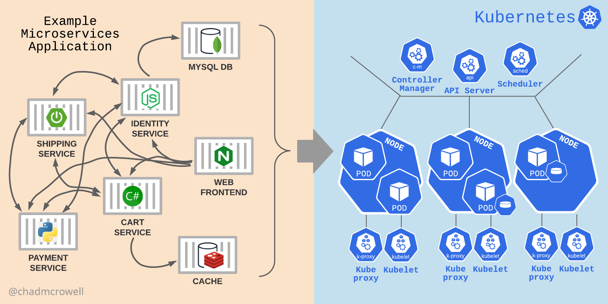

 

### Welcome to Day 1!

Kubernetes is a platform for deploying distributed applications inside of many different containers (a.k.a. container orchestration). You refer to this system as a Kubernetes cluster, as the cluster of components acting together to maintain things like storage, networking, access, and configuration of data. The VMs that comprise a cluster are called nodes.

The Kubernetes cluster consists of two main components. The control plane components (running on the control plane node) and the worker node components (running the application workloads on the worker nodes).

Kubernetes (and the containers running within) solves the problem of computers being constantly underutilized, and software becoming immutable and extremely hard to reproduce.

### DIAGRAM

**ENJOY!**
